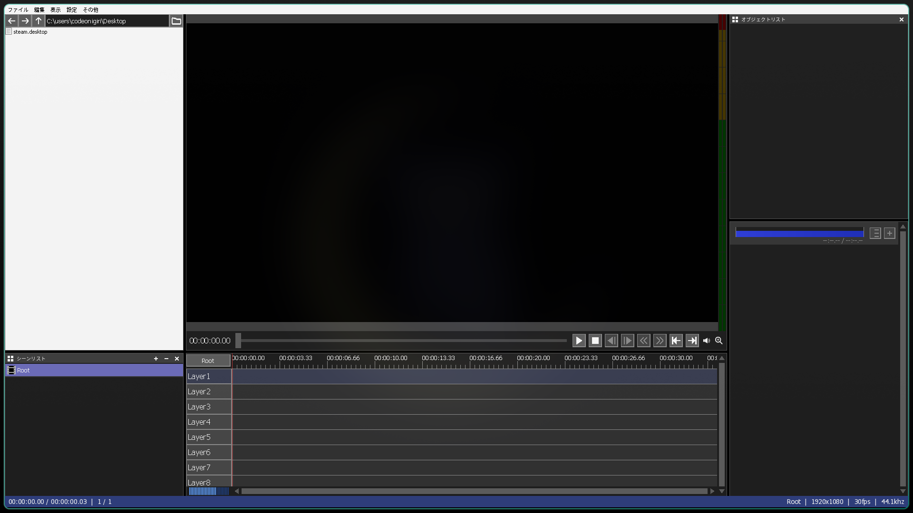

# AviUtl2 Linux 互換レイヤー

AviUtl ExEdit2（AviUtl2）を Linux 上で動作させるための実験的なセットアップです。Wine 11.12 をソースからビルドし、AviUtl2 用のパッチを適用したカスタム Wine（WoW64）で Windows バイナリを実行します。

## 状態

**AviUtl2 beta52 が Linux 上でメインウィンドウまで起動・描画できるようになりました。**

動作確認環境:

- カスタムビルド Wine 11.12（WoW64 = 64-bit + 32-bit、DirectWrite / D3D11 パッチ適用）
- WineD3D（ビルトイン `d3d11.dll` / `dxgi.dll`）
- Microsoft 製ネイティブ `d3dcompiler_47.dll`（x64 / x86）

- AviUtl2 起動 → スプラッシュ → メインウィンドウ表示
- タイムライン、動画プレビュー、テキストオブジェクトの描画
- 圧縮 AVI（H.264 等）の読み込みに成功（`CreateTexture2D` の `E_INVALIDARG` を回避）
- AVI 出力（非圧縮 / 圧縮）が正常に動作（出力時の色味・縦縞なし）
- D3D11 `CheckFormatSupport` 未対応フォーマットへの対処
- DirectWrite `HitTestPoint` / 空レイアウトの `HitTestTextPosition` 対処
- 32-bit プロセス対応（x264guiEx の `pipe32auo.exe` 等を含む出力プラグインへの道）



**現時点での制限:**

- 初期化中「D3D RDMs not supported.」ダイアログは 2 回表示されますが、Enter/Return を Wine へ送ることで回避できます（手動でも OK）。
- 日本語フォントは Noto Sans CJK JP を Wine プレフィックスにマッピングして表示しています。
- 起動直後から長時間の編集作業における安定性は未検証です。特定操作で Wine が未実装の機能に到達し、クラッシュする可能性があります。
- DXVK 経由では未対応の DXGI 内部関数で停止するため、現状 WineD3D が必要です。

## 必要なもの

- x86_64 Linux
- AVX2 対応 CPU（AviUtl2 本体の要件）
- X11 または Wayland 上の XWayland 環境
- 開発ツール（`gcc`, `make`, `pkgconf` など。Arch 系では `base-devel`）
- 依存ライブラリ（Wine 11.12 ビルド用）:
  - Arch 系例:
    ```sh
    sudo pacman -S --needed base-devel libpng libx11 libxext libxcomposite \
      libxrender libxcursor libxi libxrandr freetype2 fontconfig gnutls \
      alsa-lib vulkan-icd-loader lib32-gcc-libs lib32-glibc lib32-libx11 \
      lib32-freetype2 lib32-fontconfig lib32-alsa-lib lib32-libxcomposite \
      lib32-libxrender lib32-libxcursor lib32-libxi lib32-libxrandr
    ```
  - WoW64 ビルドには 64-bit と 32-bit の両方の X11 ライブラリが必要です。特に子ウィンドウ/D3D 描画を正しく合成するため `libxcomposite` / `lib32-libxcomposite` は必須です。
- `bsdtar`（`d3dcompiler_47.dll` 展開用）
- 日本語表示用に Noto Sans CJK JP（`noto-fonts-cjk`）が `/usr/share/fonts/noto-cjk` にインストールされていること
- ディスク容量: Wine ソースビルドで約 5GB 以上推奨

## セットアップ

```sh
# 1. Wine をソースからビルド（パッチ適用済み）
./build-wine.sh

# 2. Wine プレフィックス作成 + d3dcompiler_47 配置
./setup.sh
```

`build-wine.sh` は以下を行います:

1. Wine 11.12 ソースをダウンロード
2. `patches/` 以下の AviUtl2 用パッチを適用
3. `--enable-archs=x86_64,i386`（WoW64）で構成。Xcomposite / Xrender / Xrandr / Xcursor / XInput 等のウィンドウ合成・入力機能を有効化しています
4. `make && make install` を実行し `$PWD/wine-custom` へ配置

`setup.sh` は以下を行います:

1. 公式サイトから AviUtl2 beta52 をダウンロード・展開
2. `wine-custom` が存在することを確認（なければ `build-wine.sh` 実行を促します）
3. `pfx-custom` Wine プレフィックスを作成
4. Microsoft 製ネイティブ `d3dcompiler_47.dll`（x64 / x86）を配置し、Wine に native オーバーライドを設定
5. システムの Noto Sans CJK JP を Wine プレフィックスにコピーし、MS Gothic/Meiryo 等の日本語フォント名を Substitute するレジストリを登録

## 起動

```sh
./launch.sh
```

`launch.sh` は:

- `wine-custom/bin/wine` を使用
- `pfx-custom` プレフィックスを使用
- Wine のビルトイン `d3d11.dll` / `dxgi.dll`（WineD3D）を使用
- ネイティブ `d3dcompiler_47.dll` を使用

### 初期化ダイアログの回避

AviUtl2 起動時に「D3D RDMs not supported.」ダイアログが 2 回表示されます。手動で OK を押すか、`tools/dismiss-dialogs.py` を併用して自動的に Return を送ることができます:

```sh
# launch.sh を起動した直後に別ターミナルで
python3 tools/dismiss-dialogs.py --display :1 --count 2 --delay 2
```

## デバッグ（エラー収集）

クラッシュや未実装の Wine 関数を調査するには `debug.sh`（または `./launch.sh --debug`）を使います。起動ダイアログも自動で閉じ、Wine の重要なチャンネルの出力を `logs/debug-*.log` / `logs/debug-*.errors.log` に記録します。落ちたときのクラッシュ直前の `err:` / `fixme:` / `warn:` 行を共有してください。

```sh
./debug.sh
# または
./launch.sh --debug
```

`tools/summarize-errors.py` で繰り返しメッセージを集約できます:

```sh
python3 tools/summarize-errors.py logs/debug-YYYYMMDD_HHMMSS.errors.log
```

より詳細なレベル（例: `+relay`）が必要な場合は `DEBUG_CHANNELS` で上書きできます。

```sh
DEBUG_CHANNELS=+seh,+d3d11,+dxgi,+d2d,+dwrite,+module,+tid,+relay ./debug.sh
```

> 注意: `+relay` は非常に巨大なログを生成します。ディスク容量と実行時間に注意してください。

## プラグイン導入

### 一般的な場所

- AviUtl ExEdit2 用プラグイン（`.aui2` 等）: `C:\ProgramData\aviutl2\Plugin`
  - この Wine プレフィックスでは `pfx-custom/drive_c/ProgramData/aviutl2/Plugin`
- 従来の AviUtl プラグイン（`.auf`/`.auo` 等）: `AviUtl2.exe` と同じディレクトリの `plugins/`
  - ただし AviUtl2 専用 API でないものは動作しない可能性があります。

### L-SMASH-Works

[Mr-Ojii 氏の非公式ビルド](https://github.com/Mr-Ojii/L-SMASH-Works-Auto-Builds)から AviUtl2 用 `lwinput.aui2` を導入できます:

```sh
./tools/install-lsmash-works.sh
```

導入後、AviUtl2 を再起動し、`設定` → `入力プラグインの設定` に `L-SMASH Works File Reader for AviUtl2` が追加されているか確認してください。`.mp4` / `.mov` を読み込ませる場合は、Media Foundation より優先度を高くすると確実です（L-SMASH 側の README 参照）。

## 動画出力

AviUtl2 の標準機能では**非圧縮 AVI**、PNG/JPG 出力に対応しています。Wine 下でもこれはそのまま使えます。

### 推奨ワークフロー（非圧縮 AVI → ffmpeg）

1. AviUtl2 で `ファイル` → `出力` を選択し、フォーマットは **AVI ファイル**、圧縮コーデックは「非圧縮」で出力。
2. 出力された `.avi` をホストの ffmpeg で圧縮:

```sh
./tools/encode-output.sh output.avi output.mp4
```

ホストに ffmpeg がインストールされている必要があります。品質やコーデックを変えたい場合は、ffmpeg のオプションを追加できます:

```sh
./tools/encode-output.sh output.avi output.mp4 -crf 20 -preset veryslow
```

### 圧縮出力プラグインについて

定番の `x264guiEx` などは 32 bit ヘルパー経由で動作するものが多く、WoW64 対応 Wine があればそのまま使えます。Wine を 64 bit のみでビルドしていた場合は以下のどちらかが必要です:

- `./build-wine.sh` を `--enable-archs=x86_64,i386`（WoW64）に変更して再ビルドする。
- または Proton を使う（Proton は通常 32 bit も含む）。

`.auo2` で 64 bit 化されている `x265guiEx` などの本体は `bsdtar` でインストーラから取り出すことができます。WoW64 環境があれば、`VC_redist.x64.exe` など 32 bit 起動部を持つインストーラーも実行可能になります。

## Proton で試す

### 注意: Wine の改変を維持する場合

ここで適用している `patches/d3d11-checkformatsupport.patch` と `patches/dwrite-hittest.patch` は、**プリインストールの Proton には反映されていません**。Proton 化しつつ改変を維持するには、Proton のソースを取得して同じパッチを当ててからビルドする必要があります。

### 最も手軽な方法: Steam 非 Steam ゲームとして登録

実際に Proton Experimental で動かすには、Steam クライアントの「ライブラリ → ゲームを追加 → Steam 以外のゲームを追加」から `aviutl2.exe` を登録し、そのプロパティで **Proton Experimental** を強制指定して起動するのが確実です。Steam 経由であれば prefix 作成や Steam ランタイムの環境が整います。

### コマンドラインから試す場合（実験的）

```sh
./proton-launch.sh
```

`proton-launch.sh` は `Proton - Experimental` を探して `proton run` で起動します。ただし、Steam クライアント経由ではないため **prefix 初期化や Steam ランタイムが不完全**になりやすく、執筆時点では `libvkd3d-1.dll`/`wined3d.dll` 周りの読み込み失敗で AviUtl2 が起動しませんでした。これは Proton の CLI 起動が Steam 環境を想定しているためです。

### Proton 用の改変を自分で当てる

Proton ソースをビルドする際、同じ `patches/` を Proton 内の Wine ツリーに適用できます:

```sh
cd proton/wine
patch -p1 < ../../patches/d3d11-checkformatsupport.patch
patch -p1 < ../../patches/dwrite-hittest.patch
```

ただし Proton の Wine は通常の Wine より新しい/独自の変更が入っているため、オフセットが合わず `patch` が失敗する可能性があります。その場合はパッチを手動でリベースしてください。

## パッチ内容

現在のパッチ:

- `patches/d3d11-checkformatsupport.patch`
  - `d3d11_device_CheckFormatSupport` が一部の DXGI フォーマットフラグを問われた際に `E_FAIL` を返して AviUtl2 を停止させる問題を回避。未サポートな個別フラグは無視し、他に有効なビットがあれば `S_OK` を返します。全くサポートされないフォーマットは `E_FAIL` のままです。
- `patches/d3d11-logcreatetexture2d.patch`
  - `ID3D11Device::CreateTexture2D` 失敗時に幅・高さ・フォーマット・バインドフラグ等をログ出力する診断用パッチです。
- `patches/dwrite-hittest.patch`
  - `IDWriteTextLayout::HitTestPoint` が `E_NOTIMPL` を返して AviUtl2 が例外を投げる問題を回避。簡易的なヒットテスト実装を追加します。
- `patches/wined3d-nv12-texture.patch`
  - WineD3D の OpenGL バックエンドで `NV12` / `YV12` を `WINED3D_FORMAT_CAP_TEXTURE` として公開し、動画フレームの D3D11 テクスチャ作成を可能にします。
- `patches/wined3d-yuv-keep-texture-cap.patch`
  - `apply_format_fixups()` で YUY2/UYVY/YV12/NV12 の `COMPLEX_FIXUP` が shader backend で非サポートと判定された際、`WINED3D_FORMAT_CAP_TEXTURE` が削除されるのを防止します。これにより D3D11 の `CreateTexture2D(BIND_SHADER_RESOURCE)` が `E_INVALIDARG` で失敗するのを回避します。
- `patches/wined3d-yuy2-upload-rgba8.patch`
  - YUY2/UYVY の GL 内部フォーマットを `GL_RG8`（2 bytes/pixel）から `GL_RGBA8`（4 bytes/pixel）に変更し、アップロード時に BT.601 YUY2→B8G8R8X8 CPU 変換を行うコールバックを追加します。D3D11 SRV が直接 RGBA としてサンプリングできるようにします。
  - **注意**: プレビューの色味が一部不正（右半分の描画崩れ）という既知の問題が残っています。詳細は「既知の問題」を参照。
- `patches/wined3d-debug-texture-create.patch`
  - `wined3d_texture_init` / `resource_init` / `wined3d_texture_create` の各失敗パスに診断 WARN を追加します。デバッグ用です。
- `patches/d3d11-video-formats-gl.patch`
  - D3D11 から WineD3D へのフォーマットマッピングを、OpenGL バックエンドでもサポートされた Video フォーマット (`NV12`, `G8R8_G8B8_UNORM`, `R8G8_B8G8_UNORM`) に向けるよう変更します。`G8R8_G8B8_UNORM` / `R8G8_B8G8_UNORM` はそれぞれ `YUY2` / `UYVY` と同じ 4:2:2 packed メモリレイアウトなので、既存の YUV テクスチャ機構を再利用します。
  - 空テキストレイアウトで `HitTestTextPosition` が末尾 run を取得できずクラッシュする問題を回避します。

これらは Wine 上流にフィードバックすべき暫定対処です。

### 無効化されたパッチ（実験的、`.disabled` として保管）

- `patches/glsl-shader-yuv-color-fixup.patch.disabled`
  - `shader_glsl_color_fixup_supported` で YUY2 等 complex fixup をサポート対象に追加します。`wined3d-yuy2-upload-rgba8.patch` と同時に有効化すると二重変換が発生してプレビューが崩れるため無効化しています。
- `patches/wined3d-yuv-texture.patch.disabled`
  - `wined3d-yuy2-upload-rgba8.patch` に統合されたため無効化しています。

## 既知の問題と今後の課題

- **メイン領域が黒く表示される**: ファイル一覧やメニューは表示されるがプレビュー/タイムライン領域が真っ黒の場合、Wine が X Composite / XRender を使えていない可能性があります。上記の `libxcomposite`、`lib32-libxcomposite` 等をインストールし、`build-wine.sh` を実行し直してください。
- **長時間操作の安定性**: メインウィンドウ表示までは確認できましたが、タスク、プレビュー再生、プラグイン読み込みなどで未検証の Wine 実装に到達する可能性があります。
- **音声 / WASAPI**: Wine の音声周りで追加の設定が必要になる可能性があります。
- **DXVK**: WineD3D 以外の描画パスは現状動作しません。
- **入力自動化**: 初期化ダイアログをスクリプトで自動的に閉じる仕組みが必要です（参考実装あり）。
- **プレビューの YUY2 色味不正**: 圧縮 AVI（H.264 等、`DXGI_FORMAT_G8R8_G8B8_UNORM` = YUY2 4:2:2 packed）を読み込んだ際、プレビュー画面の色が不正（マゼンタ/グリーン基調、右半分が描画崩れ）になります。AVI 出力時は正しい色で出力されるため、WineD3D の D3D11 SRV サンプリングパスの YUY2→RGB 変換不備が原因です。
  - 根本原因: WineD3D の `shader_glsl_color_fixup_supported` が YUV 変換を非サポートと返すため、`apply_format_fixups` で `CAP_TEXTURE` が削除されます。`wined3d-yuv-keep-texture-cap.patch` でこれを防止し、`wined3d-yuy2-upload-rgba8.patch` でアップロード時に CPU YUY2→RGB 変換を行いますが、マクロピクセル構造（2 pixels / 4 bytes）と RGBA8（1 pixel / 4 bytes）のサイズ不一致により右半分が崩れます。
  - 回避策: L-SMASH Works 入力プラグイン経由で AVI を RGB で読み込むか、DXVK の使用を検討してください。
- **GUI 操作時のクラッシュ**: Alt+F 等のメニューキー操作で稀に SEGFAULT が発生します。X11 イベント処理周辺の別問題です。

## 注意

- AviUtl2 はフリーソフトですが、作者 KEN くん様の配布元以外からの再配布は禁止されています。本リポジトリは実行ファイルを同梱せず、公式サイトからダウンロードする方式を採用しています。
- Microsoft 製 `d3dcompiler_47.dll` は Microsoft の配布元から取得し、各自の責任でライセンスを確認してください。
- Wine ソースのパッチは暫定的なものです。上流 Wine が同等の修正を行えば、カスタムビルドは不要になります。

## ライセンス

本リポジトリ内のスクリプト類は MIT ライセンスとします。AviUtl2 本体の権利は作者に帰属します。
